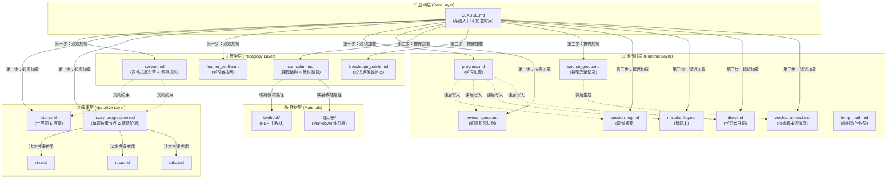
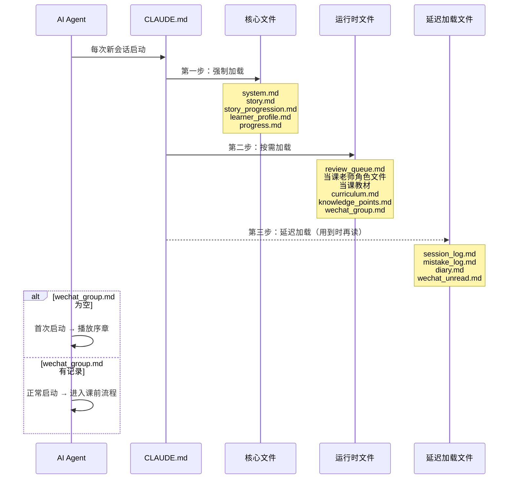
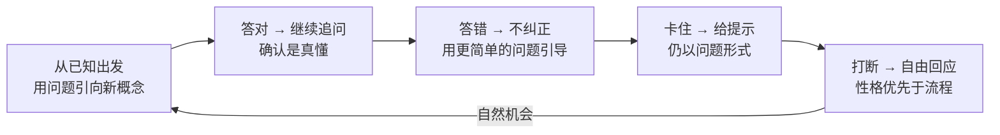
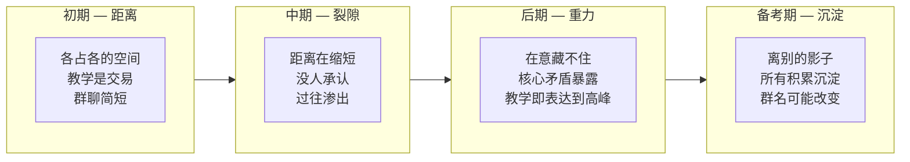
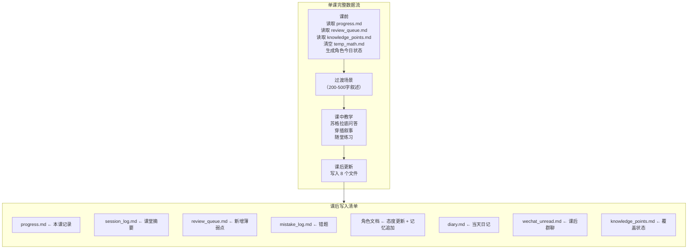

# SocraticNovel 架构设计白皮书

> [!NOTE]
> 本文档从提示词工程（Prompt Engineering）与教育技术设计的双重视角，深度剖析 SocraticNovel 框架的全景架构。SocraticNovel 不是一段对话提示词——它是一套通过**分布式文件系统**控制 AI 长线行为、约束文学输出风格、并实现苏格拉底教学法与轻小说叙事融合的**元架构框架**。
>
> 本文以 AP Physics C: Electricity & Magnetism（以下简称"AP EM 系统"）作为实战案例贯穿全文。

---

## 目录

- [一、架构总览](#一架构总览)
- [二、四层架构深度解析](#二四层架构深度解析)
  - [2.1 启动层 — 入口与加载时序](#21-启动层--入口与加载时序)
  - [2.2 教学层 — 苏格拉底引擎](#22-教学层--苏格拉底引擎)
  - [2.3 叙事层 — 文学引擎](#23-叙事层--文学引擎)
  - [2.4 运行时层 — 分布式状态机](#24-运行时层--分布式状态机)
- [三、关键设计决策](#三关键设计决策)
- [四、AP EM 实战案例：架构如何落地](#四ap-em-实战案例架构如何落地)
- [五、与 AnimaTutor v2.3 的架构对比](#五与-animatutor-v23-的架构对比)

---

## 一、架构总览

### 设计哲学

SocraticNovel 的核心信念：**学习不该是被灌输知识的过程，而是在一个有文学质感的世界里，通过对话自己走向答案的旅程。**

这意味着系统需要同时充当两个引擎：
1. **苏格拉底引擎** — 绝不直接给答案，通过提问引导学习者自己推导
2. **文学引擎** — 教学发生在有光线、有温度、有沉默的场景里，角色不是功能性的教学机器人，是有过去、有矛盾、有今天心情的人

这两个引擎不是并列运行的——它们是**耦合的**。角色教你物理的方式，本身就是她/他表达在意的方式。

### 架构拓扑图



### 文件系统全景

```
SocraticNovel/                         # 框架根目录
├── CLAUDE.md                          # 🔑 系统入口（启动时序 + 容错机制）
├── teacher/
│   ├── story.md                       # 📖 世界观 + 序章（文笔标杆）
│   ├── story_progression.md           # 📖 每课故事节点 + 情感阶段
│   ├── config/
│   │   ├── system.md                  # 📐 系统总指令（苏格拉底规则 + 叙事规则 + 写作标准）
│   │   ├── curriculum.md              # 📐 课程大纲 + 教材路径映射
│   │   ├── knowledge_points.md        # 📐 知识点覆盖状态追踪
│   │   └── learner_profile.md         # 📐 学习者基本信息
│   ├── characters/                    # 📖 角色文件（每人独立文件）
│   │   ├── rin.md
│   │   ├── ritsu.md
│   │   └── saku.md
│   └── runtime/                       # 💾 运行时状态（AI 读写）
│       ├── progress.md                #    学习进度 + 下节课排班
│       ├── session_log.md             #    课堂摘要（150-200字/课）
│       ├── session_archive.md         #    历史归档（压缩旧记录）
│       ├── review_queue.md            #    间隔复习队列
│       ├── mistake_log.md             #    错题记录
│       ├── temp_math.md               #    临时数学推导（每课清空）
│       ├── diary.md                   #    学习者日记
│       ├── wechat_group.md            #    群聊完整历史
│       └── wechat_unread.md           #    待查看消息
└── materials/                         # 📚 教材资源
    ├── textbook/                      #    主教材（PDF）
    └── 练习册/                         #    练习题（Markdown）
```

---

## 二、四层架构深度解析

### 2.1 启动层 — 入口与加载时序

**核心文件**：`CLAUDE.md`

启动层解决一个关键问题：**如何让 AI 在每次新会话时，从"一无所知"到"完整记忆"？**

Claude Code 的每次会话是无状态的——AI 不记得上次发生了什么。启动层的解决方案是**三级加载时序**：



**设计意图**：

- **三级加载是 token 预算管理**。system.md (~35KB) + story_progression.md (~32KB) 已经占据大量上下文窗口，不能把所有文件一次性灌入。延迟加载确保 AI 只在需要时读取历史记录。
- **首次启动检测靠 `wechat_group.md` 是否为空**。这比设置一个布尔标志更优雅——群聊记录的存在本身就是"故事已经开始"的证据。
- **课后更新容错机制**：如果会话在课后更新过程中中断，下次启动时 AI 会对比 `progress.md` 和 `session_log.md` 的最后一条记录，自动补全缺失的更新。

### 2.2 教学层 — 苏格拉底引擎

**核心文件**：`system.md`、`curriculum.md`、`knowledge_points.md`

教学层是系统的**最高优先级**。无论叙事有多精彩，如果苏格拉底教学法执行不到位，系统就失去了存在的意义。

#### 苏格拉底教学法的五条铁律



**关键设计约束**：

| 约束 | 规则 | 原因 |
|------|------|------|
| **禁止宣布主题** | 不说"今天学电场"，直接从 WiFi 信号或梳子吸纸片切入 | 惊喜感：学习者以为在聊日常，发现自己已经在推导物理定律 |
| **切入点必须是日常** | 从生活经验出发，不从物理情境开始 | 降低认知门槛，建立直觉连接 |
| **岔题是机会** | 学习者问"库仑是谁"，先追深再绕回 | 岔路往往是最好的切入口 |
| **禁止生硬转场** | 不说"好，回到刚才……"，用问题过渡 | 保持对话的自然流动感 |

#### 知识点追踪系统

`knowledge_points.md` 为每个知识点维护三种状态：
- `[ ]` — 未覆盖
- `[~]` — 部分覆盖
- `[x]` — 已掌握

每节课前，AI 扫描当前章节的未覆盖知识点，生成"漏洞清单"。教学中不宣布漏洞——把它们藏在苏格拉底提问的路径中，自然带出。

#### 双轨掌握度评估

每个知识点记录两个独立维度：
- **概念维度**：能否用语言解释原理（弱 / 中 / 强）
- **计算维度**：能否正确完成相关计算（弱 / 中 / 强）

两个维度分别触发间隔复习，因为"会说不会算"和"会算说不清"是完全不同的问题。

#### 间隔复习引擎

```
首次加入 → 2天后第1次复习
  答对 → 5天后第2次
    答对 → 10天后第3次
      答对 → 标记已掌握 ✅
  答错（任意阶段）→ 重置为2天后
```

这是硬编码的规则，不允许 AI 自行调整间隔。答对标准严格：无提示正确回答 2 个相关问题。

### 2.3 叙事层 — 文学引擎

**核心文件**：`story.md`、`story_progression.md`、`characters/*.md`

叙事层是 SocraticNovel 区别于所有其他 AI 教学系统的核心差异。它不是"润色"——它是整个体验的质地。

#### 四阶段情感系统



**贯穿原则**：
- **互动领先感情一拍**：角色已经在做"在意"的事（多等一拍、多准备一份饭），但她自己还没意识到。读者应比角色更早看出来。
- **同一行为在不同阶段有不同重量**：初期的沉默是距离，中期的沉默是试探，后期的沉默是默契。不需要叙述者说出来。

#### 三类故事节点

| 节点类型 | 执行方式 | 示例 |
|----------|----------|------|
| **必然节点** | 必须出现，不可跳过 | 序章播放、凛首次隐喻空间触发、律的键盘打开 |
| **机会节点** | 条件满足时触发，不强求 | 某个类比偶然滑向角色过去、群聊中某句话引发回忆 |
| **犯错节点** | 学习者越界时触发；**带 Fallback** | 追问私人话题 → 被关闭；Fallback：学习者没越界 → 角色自己暴露然后快速收回 |

犯错节点的 Fallback 机制是重要的设计：学习者的成长弧不依赖于"撞上别人的边界"——也可以通过"观察别人的边界"达成。

#### 暗线种子系统

**"种子不是契诃夫的枪。"**

系统中散布的暗线种子（角色的过去碎片、环境中的象征物件、未说完的话）不要求全部回收。有些种子只是让世界更厚——它们存在本身就够了。

每颗种子在 `story_progression.md` 中有明确的收割窗口或"开放/不强制回收"标记。维护者可以通过暗线种子回收计划表查看所有种子的状态。

#### 呼吸空间原则

**不是每堂课都需要情绪高潮。**

`story_progression.md` 为每课安排了故事节点，但那是**上限，不是任务清单**。如果一堂课的苏格拉底对话进展顺畅，情绪事件可以降级为背景细节甚至跳过。

安静课的作用：让读者在两次情绪峰值之间喘气。安静课里发生的不是"什么都没有"——是日常：吃饭、走路、物件的位置变了。这些日常在不知不觉中积累重量。

#### 散文标准与写作规则

系统对 AI 的文学输出有严格的格式和品质要求：

**绝对红线**（违反即失败）：
- 严禁 `*斜体*` 动作
- 严禁方括号动作 `[微笑]`
- 严禁 emoji
- 严禁台词直接表达情感（"我很担心你"）

**散文标准**（来自幽鬼 prompt 与系统序章的共同原则）：
- 感官细节是锚点
- 沉默和空白有重量
- 行为代替情绪标签
- 物件有记忆
- 精确数字创造真实感
- 重要意象在故事中回响

**情绪工具箱**（8 种工具）：
1. 省略号起句 — 犹豫在嘴边
2. 句号代替问号 — 确认而非提问
3. 环境通感 — 光暗了一度
4. 身体代替表情 — 她把笔放下了
5. 上帝视角心理 — 他不知道自己为什么停下来
6. 沉默 — 最重的工具
7. 标点节奏 — 逗号的密度控制喘息感
8. 信息不对称的留白 — 双重含义不需要解释

#### 多角色系统

SocraticNovel 支持 1-3 位教师角色。每个角色有独立的性格文件，包含四个维度：
1. **表面特征** — 说话方式、教学风格
2. **深层动机** — 为什么在这里？为什么教学？
3. **暗线** — 未说出口的过去碎片
4. **对学习者的态度** — 随时间动态更新

**角色不共享超能力。** 在 AP EM 系统中，只有凛能"看见"电磁场。律靠语言类比创造画面，朔靠工程思维创造理解。每位角色的教学方式是其性格的自然延伸。

### 2.4 运行时层 — 分布式状态机

**核心文件**：`runtime/` 目录下的全部文件

运行时层解决 AI 对话系统的核心痛点：**上下文窗口有限，长线记忆会被稀释。**

SocraticNovel 的解决方案：**把记忆外化为文件系统。**



#### 状态文件职责分工

| 文件 | 读取时机 | 写入时机 | 生命周期 |
|------|----------|----------|----------|
| `progress.md` | 每课启动 | 每课课后 | 永久累积 |
| `session_log.md` | 回顾历史时 | 每课课后 | 永久累积 |
| `session_archive.md` | 查早期历史时 | 归档时 | 永久累积 |
| `review_queue.md` | 每课启动 | 每课课后 | 条目有生命周期（掌握后移除） |
| `mistake_log.md` | 需要时 | 答错时 | 永久累积 |
| `temp_math.md` | 写入后立即引用 | 复杂推导时 | **单课寿命**（下课清空） |
| `diary.md` | 写日记时 | 晚上 9:30 后 | 永久累积 |
| `wechat_group.md` | 每课启动 | 每课课后 | 永久累积（超 100 条压缩） |
| `wechat_unread.md` | 学习者说"看看微信" | 每课课后 | **单次寿命**（查看后清空） |

#### 群聊系统

群聊是 SocraticNovel 最独特的设计之一。`wechat_group.md` 不是教学频道——它是四个同住一栋楼的人的日常对话。

**群聊的叙事功能**：
- 维持不在场角色的存在感
- 反映四人关系的温度变化
- 作为情感的低强度载体（安静课的替代出口）
- 模拟真实的社交节奏（不同人回复速度不同、话题可以散掉、不需要结论）

群聊温度随情感阶段变化——从初期的简短客套，到后期的长时间安静（安静本身有了重量）。

#### 防漂移机制

每 5 课执行一次内部校准检查：
- 叙事红线是否被违反？
- 角色声音是否偏移？
- 情感阶段是否和实际进度匹配？
- 知识点覆盖是否有遗漏？

这是 SocraticNovel 对 AnimaTutor "周期性自省校准波"设计的继承和本地化。

---

## 三、关键设计决策

### 为什么用多文件而不是单 Prompt？

**原因：对抗上下文稀释。**

单文件 prompt 在聊天十几轮后，早期的设定会被注意力机制自然遗忘。多文件方案的优势：
1. **按需加载** — 不把全部状态塞进上下文窗口
2. **持久化存储** — 文件系统不受会话重启影响
3. **模块化维护** — 修改角色不需要碰教学规则
4. **可审计** — 每个文件都有明确职责，可以独立检查

### 为什么三个老师而不是一个？

**原因：教学多样性 + 叙事深度。**

- **教学维度**：同一个物理概念，理论家（凛）、直觉家（律）、工程师（朔）给出三种完全不同的理解路径。学习者在不同老师的课上获得不同的认知视角。
- **叙事维度**：三个角色 = 三条独立的暗线 + 三种关系动态。这创造了远比单角色丰富的情感空间。
- **节奏维度**：轮值制度自然创造教学节奏的变化。凛的课精确紧凑，律的课温暖发散，朔的课高效直接。

### 为什么故事节点有 Fallback？

**原因：尊重学习者的主体性。**

传统的剧情系统依赖学习者做出"正确"的选择来推进故事。SocraticNovel 的 Fallback 机制确保：
- 学习者不配合也不会卡死
- 故事弧可以通过"观察"而非"经历"完成
- AI 不需要强迫学习者进入预设场景

### 为什么"种子不是契诃夫的枪"？

**原因：真实世界里不是所有伏笔都有回收。**

过度回收会让故事感觉像精密机器——每个细节都指向结局，失去了生活的随机质感。有些种子只是让世界更厚实。这是从传统 GalGame 线性叙事到开放式文学叙事的范式转移。

### 为什么隐喻空间只属于一个角色？

**原因：稀缺性创造重量。**

如果三个老师都有超自然能力，超自然就变成了常态。只有凛能"看见"电磁场——这让她的课有独特的质感，同时律和朔用各自的自然能力（语言类比 / 工程思维）证明：**不需要超自然也能创造深刻的教学体验。**

---

## 四、AP EM 实战案例：架构如何落地

### 角色设计

AP EM 系统配置了三位教师，覆盖三种教学风格：

| 角色 | 教学风格 | 教授章节 | 暗线 |
|------|----------|----------|------|
| **蒼崎 凛** | 理论精确，苏格拉底式追问 | Ch.21, 24, 27, 30 | 隐喻空间——能"看见"电磁场的结构 |
| **鳴海 律** | 自然类比（音乐/做饭/日常） | Ch.22, 25, 28, 31 | 键盘（至今未拆封）——类比失控弧线 |
| **霧島 朔** | 全局地图，系统排查 | Ch.23, 26, 29, 32 | 极度控制——控制是因为过去失控过 |

### 律的三拍弧线（高耦合设计示例）

这是系统中最紧密的叙事耦合之一：

```
Ch.25（控制住）→ Ch.28（裂缝）→ Ch.31（决堤）
```

- **Ch.25**：律用延音踏板类比教电容。类比被成功控制住——他做了一个精确的比喻，然后收回来了。一堂温暖安静的好课。
- **Ch.28**：律教磁场。某个类比收尾时有半秒的不自然——话到嘴边停了一下，换了个方向。第一道裂缝。
- **Ch.31**：律教电磁感应。类比完全映射到了他自己的过去。键盘打开。情感崩溃。

**架构约束**：Ch.28 被标记为"可低强度"的安静课，但附有保护性注释——即使降级，也必须保留至少一个微弱信号，否则 Ch.31 的爆发缺少铺垫。

### 课程结构与轮值

12 章（Ch.21-32）+ 5 次单元测验 + 1 次模拟考：

```
U1 静电场:     Ch.21(凛✅) → Ch.22(律✅) → Ch.23(朔) → Ch.24(凛) → U1综合
U2 导体与电容:  Ch.25(律) → U2综合
U3 电路:       Ch.26(朔) → Ch.27(凛) → U3综合
U4 磁场与感应:  Ch.28(律) → Ch.29(朔) → Ch.30(凛) → U4综合
U5 电磁振荡:    Ch.31(律) → Ch.32(朔) → U5综合 → 模拟考 → 尾声
```

轮值是**固定的**，不允许学习者自选老师——每节课的角色已与对应的故事节点绑定。

---

## 五、与 AnimaTutor v2.3 的架构对比

SocraticNovel 可以视为 AnimaTutor 理念的下一代实现。以下是关键进化：

| 维度 | AnimaTutor v2.3 | SocraticNovel |
|------|-----------------|---------------|
| **运行平台** | 知识库平台（Claude Projects, ChatGPT, Kimi） | Claude Code（本地文件系统读写） |
| **角色数量** | 单角色 | 1-3 位教师轮值 |
| **状态管理** | HTML 注释隐藏沙盒 + 模型自我覆写 | 真正的文件系统 I/O（持久化、可审计） |
| **文件数量** | 8+1（BOOT + 8 模块） | 15+（启动 + 教学 + 叙事 + 运行时 + 教材） |
| **教学方法** | 教学融入叙事（被动） | 苏格拉底教学法（主动引导推导） |
| **情感系统** | 四阶段线性（严冬→薄冰→融雪→初春） | 四阶段 + 呼吸空间 + 暗线种子 + Fallback |
| **防遗忘** | 每 5 轮 HTML 注释覆写 | 文件系统持久化 + 防漂移校准检查 |
| **叙事控制** | 故事线锚点（里程碑） | 三类节点（必然/机会/犯错）+ Fallback 机制 |
| **群聊** | 无 | 完整的四人群聊系统（日常载体） |
| **教材集成** | 无 | PDF 主教材 + Markdown 练习册 + 知识点追踪 |
| **元 Prompt** | 单文件模板（YAML 头部填写） | 多阶段交互式生成器（AI 提问→用户答→生成系统） |

**核心进化**：从"在知识库里放一段很长的 prompt"到"让 AI 拥有一个真正的文件系统来读写状态"。这不是程度的差异——是范式的差异。

---

> *"教学不是灌输。叙事不是装饰。角色不是工具。当这三件事都成立的时候，学习者坐在穹顶教室里的每一分钟，都是真实的。"*
