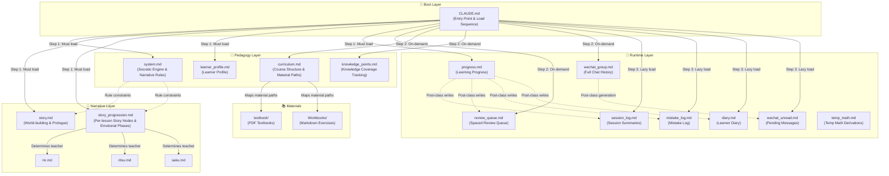
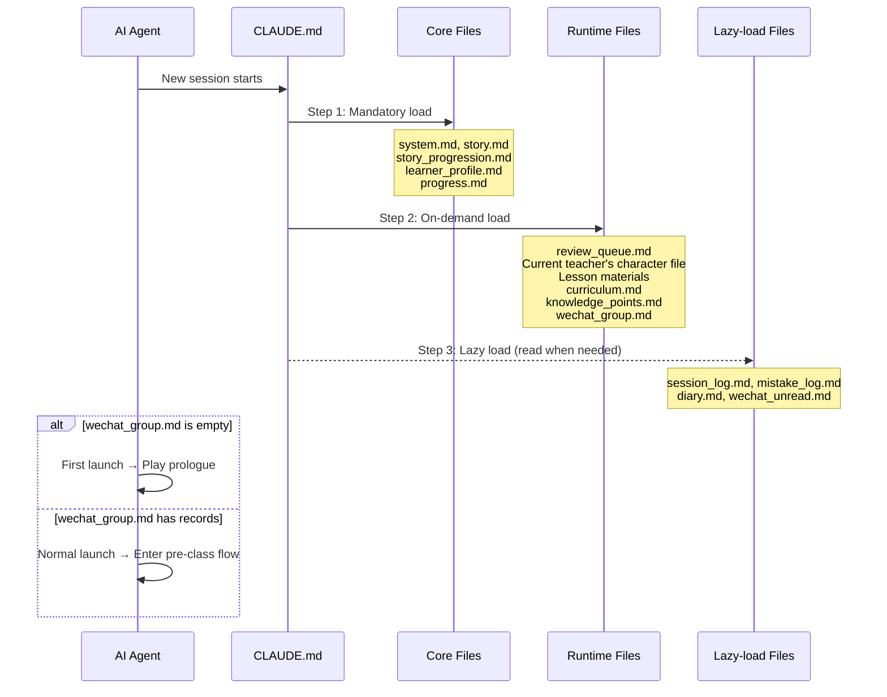

# SocraticNovel Architecture Whitepaper

> [!NOTE]
> This document dissects the SocraticNovel framework from the dual perspectives of Prompt Engineering and educational technology design. SocraticNovel is not a single conversation prompt — it is a **meta-architectural framework** that uses a **distributed file system** to control long-term AI behavior, enforce literary output quality, and fuse Socratic pedagogy with light novel narrative.
>
> AP Physics C: Electricity & Magnetism (the "AP EM system") is used as a running case study throughout.

---

## Table of Contents

- [1. Architecture Overview](#1-architecture-overview)
- [2. Four-Layer Architecture Deep Dive](#2-four-layer-architecture-deep-dive)
  - [2.1 Boot Layer — Entry & Load Sequencing](#21-boot-layer--entry--load-sequencing)
  - [2.2 Pedagogy Layer — The Socratic Engine](#22-pedagogy-layer--the-socratic-engine)
  - [2.3 Narrative Layer — The Literary Engine](#23-narrative-layer--the-literary-engine)
  - [2.4 Runtime Layer — Distributed State Machine](#24-runtime-layer--distributed-state-machine)
- [3. Key Design Decisions](#3-key-design-decisions)
- [4. AP EM Case Study: Architecture in Practice](#4-ap-em-case-study-architecture-in-practice)
- [5. Comparison with AnimaTutor v2.3](#5-comparison-with-animatutor-v23)

---

## 1. Architecture Overview

### Design Philosophy

SocraticNovel's core belief: **Learning should not be passive knowledge absorption — it should be a journey of self-discovery within a literary world.**

This requires the system to simultaneously run two engines:
1. **Socratic Engine** — Never give direct answers; guide the learner to derive knowledge through questioning
2. **Literary Engine** — Teaching occurs in scenes with light, temperature, and silence; characters are not functional bots but people with histories, contradictions, and moods

These engines are not parallel — they are **coupled**. The way a character teaches physics is itself how they express care.

### Architecture Topology



### File System Overview

```
SocraticNovel/
├── CLAUDE.md                          # 🔑 Entry point (load sequence + fault tolerance)
├── teacher/
│   ├── story.md                       # 📖 World-building + prologue (prose benchmark)
│   ├── story_progression.md           # 📖 Per-lesson story nodes + emotional phases
│   ├── config/
│   │   ├── system.md                  # 📐 Master instructions (Socratic rules + narrative rules + writing standards)
│   │   ├── curriculum.md              # 📐 Course outline + material path mapping
│   │   ├── knowledge_points.md        # 📐 Knowledge coverage tracking
│   │   └── learner_profile.md         # 📐 Learner information
│   ├── characters/                    # 📖 Character files (one per teacher)
│   └── runtime/                       # 💾 Runtime state (AI reads/writes)
│       ├── progress.md                #    Learning progress + next teacher assignment
│       ├── session_log.md             #    Session summaries (150-200 words/lesson)
│       ├── session_archive.md         #    Historical archive (compressed old records)
│       ├── review_queue.md            #    Spaced repetition queue
│       ├── mistake_log.md             #    Mistake records
│       ├── temp_math.md              #    Temporary math derivations (cleared each lesson)
│       ├── diary.md                   #    Learner diary
│       ├── wechat_group.md            #    Group chat full history
│       └── wechat_unread.md           #    Pending unread messages
└── materials/                         # 📚 Teaching materials
    ├── textbook/                      #    Main textbooks (PDF)
    └── workbooks/                     #    Exercise books (Markdown)
```

---

## 2. Four-Layer Architecture Deep Dive

### 2.1 Boot Layer — Entry & Load Sequencing

**Core File**: `CLAUDE.md`

The Boot Layer solves a critical problem: **How does an AI go from "knowing nothing" to "full memory" at the start of each session?**

Claude Code sessions are stateless. The solution is a **three-tier loading sequence**:



**Design Rationale**:

- **Three-tier loading is token budget management.** system.md (~35KB) + story_progression.md (~32KB) already consume significant context. Lazy loading ensures the AI only reads history files when needed.
- **First-launch detection uses `wechat_group.md` emptiness.** More elegant than a boolean flag — the existence of chat history *is* proof that the story has begun.
- **Post-class fault tolerance**: If a session breaks during post-class updates, the AI compares `progress.md` and `session_log.md` on next startup to auto-complete missing writes.

### 2.2 Pedagogy Layer — The Socratic Engine

**Core Files**: `system.md`, `curriculum.md`, `knowledge_points.md`

The Pedagogy Layer is the system's **highest priority**. No matter how brilliant the narrative, if Socratic teaching execution fails, the system loses its reason for existence.

#### Five Iron Rules of Socratic Teaching

| Rule | Description |
|------|-------------|
| **Start from known** | Begin with the learner's existing intuitions, use questions to lead toward new concepts |
| **Right answer → dig deeper** | Confirm genuine understanding, not lucky guessing |
| **Wrong answer → don't correct** | Pose a simpler question that helps them discover their own error |
| **Stuck → hint as question** | Give hints, but always in question form |
| **Interruption → personality first** | Respond freely based on character personality; gently guide back when natural |

**Critical Constraints**:
- **Never announce the topic.** Don't say "today we learn electric fields" — start from WiFi signals or combs attracting paper.
- **Entry point must be everyday life.** Not "consider two point charges..." — start from real experience.
- **Tangents are opportunities.** If the learner asks "who was Coulomb?", go deeper before circling back.
- **No hard transitions.** Don't say "OK, back to what we were discussing..." — use a new question to navigate.

#### Dual-Track Mastery Assessment

Every knowledge point tracks two independent dimensions:
- **Conceptual**: Can the learner explain the principle in words? (weak / medium / strong)
- **Computational**: Can the learner correctly perform related calculations? (weak / medium / strong)

"Can explain but can't calculate" and "can calculate but can't explain" are different problems requiring different review schedules.

#### Spaced Repetition Engine

```
First entry → Review after 2 days
  Pass → 5 days later
    Pass → 10 days later
      Pass → Marked mastered ✅
  Fail (any stage) → Reset to 2 days
```

Hard-coded rules. Pass standard: correctly answer 2 related questions without hints.

### 2.3 Narrative Layer — The Literary Engine

**Core Files**: `story.md`, `story_progression.md`, `characters/*.md`

The Narrative Layer is what separates SocraticNovel from every other AI teaching system. It's not decoration — it's the texture of the entire experience.

#### Four-Phase Emotional System

| Phase | Approximate Range | Tone |
|-------|-------------------|------|
| **Early — Distance** | Ch.23-24 | Everyone in their own space. Teaching is transactional. |
| **Middle — Cracks** | Ch.25-29 | Distance shrinking, nobody admits it. Pasts leaking through. |
| **Late — Gravity** | Ch.30-32 | Care can't be hidden. Core conflicts exposed. |
| **Exam Prep — Settling** | Final review | The weight of goodbye. |

**Governing Principles**:
- **Interaction leads emotion by one beat.** Characters do caring things (wait an extra beat, prepare an extra meal) before they realize they care. The reader should notice before the character does.
- **Same behavior, different weight across phases.** Early silence is distance. Middle silence is testing. Late silence is understanding.

#### Three Types of Story Nodes

| Type | Execution | Example |
|------|-----------|---------|
| **Inevitable** | Must happen, cannot skip | Prologue, Rin's first metaphor space trigger |
| **Opportunity** | Triggered when conditions are met | An analogy accidentally touching a character's past |
| **Mistake** | Triggered when learner crosses a line; **has Fallback** | Pushing a private question → gets shut down; Fallback: character reveals something themselves, then pulls back |

The Fallback mechanism is essential: the learner's growth arc doesn't depend on "crashing into someone's boundary" — it can also be achieved by "observing someone's boundary."

#### Shadow Seed System

**"Seeds are not Chekhov's guns."**

Shadow seeds (character past fragments, symbolic objects, unfinished sentences) scattered throughout the story do not all require resolution. Some seeds just make the world thicker — their existence alone is enough.

#### Breathing Room Principle

**Not every lesson needs an emotional climax.** Story nodes per lesson are an upper bound, not a checklist. If Socratic dialogue flows well, emotional events can downgrade to background details or be skipped entirely.

#### Writing Standards

**Absolute Red Lines** (violation = failure):
- No `*italic*` actions
- No bracket actions `[smiles]`
- No emoji
- No direct emotional dialogue ("I'm worried about you")

**Prose Standards** (from the system prologue and reference prompts):
- Sensory details as anchors
- Silence and empty space have weight
- Behavior replaces emotion labels
- Objects accumulate memory
- Precise numbers create authenticity
- Important images resonate across the story

### 2.4 Runtime Layer — Distributed State Machine

**Core Files**: All files under `runtime/`

The Runtime Layer addresses the core pain point of AI dialogue systems: **limited context windows lead to long-term memory dilution.**

SocraticNovel's solution: **Externalize memory to the filesystem.**

| File | Read When | Written When | Lifecycle |
|------|-----------|-------------|-----------|
| `progress.md` | Every lesson start | Every post-class | Permanent accumulation |
| `session_log.md` | Reviewing history | Every post-class | Permanent accumulation |
| `review_queue.md` | Every lesson start | Every post-class | Items have lifecycle (removed on mastery) |
| `mistake_log.md` | When needed | On wrong answers | Permanent accumulation |
| `temp_math.md` | After writing | Complex derivations | **Single-lesson lifespan** (cleared next class) |
| `diary.md` | Writing diary | After 9:30 PM | Permanent accumulation |
| `wechat_group.md` | Every lesson start | Every post-class | Permanent (compressed after 100 entries) |
| `wechat_unread.md` | Learner says "check messages" | Every post-class | **Single-use** (cleared after viewing) |

#### Group Chat System

The group chat (`wechat_group.md`) is not a teaching channel — it's the daily life of four people sharing a building.

**Narrative functions**:
- Maintains presence of off-duty characters
- Reflects relationship temperature changes
- Serves as low-intensity emotional outlet
- Simulates real social rhythms (different reply speeds, topics can drift, no conclusion needed)

#### Anti-Drift Mechanism

Every 5 lessons, an internal calibration check runs:
- Have narrative red lines been violated?
- Has character voice drifted?
- Does the emotional phase match actual progress?
- Are there knowledge coverage gaps?

---

## 3. Key Design Decisions

### Why Multiple Files Instead of a Single Prompt?

**Fighting context dilution.** A single prompt loses early settings after a dozen turns. Multi-file architecture enables:
- On-demand loading (not everything in context at once)
- Persistent storage (survives session restarts)
- Modular maintenance (edit characters without touching teaching rules)
- Auditability (each file has clear responsibility)

### Why Three Teachers Instead of One?

**Teaching diversity + narrative depth.**
- **Pedagogically**: Same concept, three completely different understanding paths (theorist / intuitive / engineer)
- **Narratively**: Three characters = three independent storylines + three relationship dynamics
- **Rhythmically**: Rotation naturally varies teaching pace

### Why Do Story Nodes Have Fallbacks?

**Respecting learner agency.** Traditional plot systems depend on learners making the "right" choices. Fallbacks ensure:
- Non-cooperation doesn't break the story
- Growth arcs can complete through observation, not just experience
- The AI never forces learners into predetermined scenes

### Why "Seeds Are Not Chekhov's Guns"?

**Real life doesn't resolve every setup.** Over-resolving makes a story feel like a precision machine. Some seeds just add texture — existing without needing closure. This is a paradigm shift from linear visual novel narrative to open literary narrative.

---

## 4. AP EM Case Study: Architecture in Practice

### Character Design

The AP EM system features three teachers covering three teaching styles:

| Character | Style | Chapters | Arc |
|-----------|-------|----------|-----|
| **Rin (蒼崎 凛)** | Precise theory, Socratic questioning | Ch.21, 24, 27, 30 | Metaphor space — can "see" electromagnetic field structures |
| **Ritsu (鳴海 律)** | Daily-life analogies | Ch.22, 25, 28, 31 | Keyboard (still sealed) — analogy breakdown arc |
| **Saku (霧島 朔)** | Systems thinking, engineering | Ch.23, 26, 29, 32 | Extreme control — control because she once lost it |

### Ritsu's Three-Beat Arc (High-Coupling Design Example)

```
Ch.25 (controlled) → Ch.28 (crack) → Ch.31 (collapse)
```

- **Ch.25**: Sustain pedal analogy for capacitors. Successfully controlled — a precise metaphor, pulled back in time. A warm, quiet, good lesson.
- **Ch.28**: Teaching magnetism. An analogy ends with half a second of awkwardness — words stop mid-sentence, redirected. First crack.
- **Ch.31**: Teaching electromagnetic induction. Analogy completely maps to his own past. Keyboard opens. Emotional collapse.

**Architectural constraint**: Ch.28 is marked as a potential "quiet lesson" with a protective note — even if downgraded, at least one faint signal must be preserved to set up Ch.31's explosion.

---

## 5. Comparison with AnimaTutor v2.3

SocraticNovel can be viewed as the next-generation implementation of AnimaTutor's philosophy.

| Dimension | AnimaTutor v2.3 | SocraticNovel |
|-----------|-----------------|---------------|
| **Platform** | Knowledge-base platforms (Claude Projects, ChatGPT, Kimi) | Claude Code (native local filesystem I/O) |
| **Characters** | Single character | 1-3 teacher rotation |
| **State Management** | HTML comment hidden sandbox + model self-overwrite | Real filesystem I/O (persistent, auditable) |
| **File Count** | 8+1 (BOOT + 8 modules) | 15+ (boot + pedagogy + narrative + runtime + materials) |
| **Teaching Method** | Teaching embedded in narrative (passive) | Socratic method (active guided derivation) |
| **Emotional System** | Four linear phases | Four phases + breathing room + shadow seeds + fallbacks |
| **Anti-Forgetting** | HTML comment overwrite every 5 turns | Filesystem persistence + anti-drift calibration |
| **Narrative Control** | Story anchor milestones | Three node types (inevitable / opportunity / mistake) + fallbacks |
| **Group Chat** | None | Full four-person daily chat system |
| **Material Integration** | None | PDF textbooks + Markdown exercises + knowledge tracking |
| **Meta Prompt** | Single-file template (YAML header fill) | Multi-phase interactive generator (AI asks → user answers → system generated) |

**Core evolution**: From "putting a long prompt in a knowledge base" to "giving the AI a real filesystem to read and write state." This isn't a difference of degree — it's a difference of paradigm.

---

> *"Teaching is not telling. Narrative is not decoration. Characters are not tools. When all three hold true, every minute the learner spends in the domed classroom is real."*
